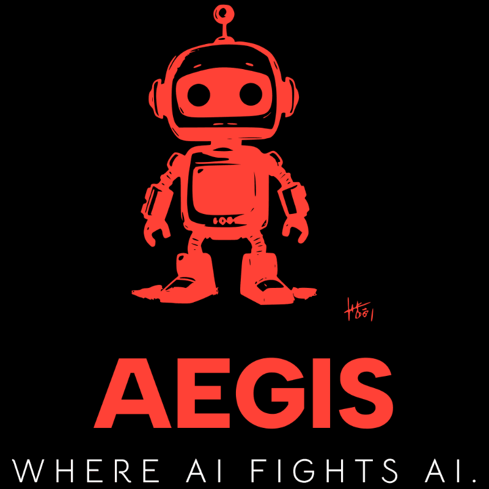

# AEGIS - Adversarial Evaluation Genuineness Intelligence System
## THE ALCHEMISTS

  

 

AEGIS is an adversarial AI-powered technical assessment platform focused on investigating how modern Large Language Models (LLMs) reason, fail, hallucinate, and can be manipulated through carefully engineered adversarial prompting techniques.

---

## Project Aim

To build an adversarial AI platform that weaponises prompt engineering to deliberately confuse, trick, and outsmart language models, creating assessment questions that humans can solve but AI cannot, while investigating how different AI models reason, fail, and can be manipulated through carefully crafted adversarial techniques.

---

# Documentation

## Functional Requirements / SRS
- [Software Requirements Specification (SRS)](docs/SRS.md)

## Design Specifications

- [Design Style](docs/DesignStyle.pdf)

- [Design Wireframes](docs/WIREFRAME.pdf)

---

# GitHub Project Board

- [AEGIS Project Board] (https://github.com/orgs/COS301-SE-2026/projects/59/views/1)
    
---

# Team Members

## Kutlwano Tau

**Role:** Team Lead & Backend Developer 

**Profile description:**
Final-year Computer Science student at University of Pretoria with a strong foundation in software development, algorithms, and system design. I have experience building full-stack applications and enjoy working with backend technologies.
I enjoy solving problems, learning new technologies, and applying computer science concepts to real-world projects.

**LinkedIn:** (https://www.linkedin.com/in/kutlwano-tau-b25983244)

---

## Sambulo Zikhali

**Role:** Data Engineer  

**Profile description:**
I am a passionate Full Stack Developer experienced in building end to end web applications using modern technologies like Next.js, React, and TypeScript. I enjoy bridging the gap between robust, scalable backend architectures and intuitive, user centric frontends. Whether it's implementing real time, dynamic UI development or designing secure APIs, I am driven by the challenge of creating seamless digital experiences. I pride myself on writing clean, maintainable code and continuously exploring new ways to refine my craft across the entire stack.

**LinkedIn:** (https://www.linkedin.com/in/sambulo-zikhali-468669261)

---

## Luyanda Ndlovu

**Role:** Frontend Developer

**Profile description:**
I'm a student in the BSc Information & Knowledge Systems program studying software engineering, and I'm interested in web design and front-end programming.
I obtained hands-on experience creating real-world apps by creating a full-stack version control solution for the IMY220 module. My passion for designing intuitive and eye-catching user interfaces was ignited by this encounter.
I like to create cutting-edge, useful applications by fusing the logical side of programming with the artistic side of design, and I'm constantly trying to get better at what I do.

**LinkedIn:** (https://www.linkedin.com/in/luyanda-ndlovu-02a281375)

---

## Myron Wheeler

**Role:** Backend Developer & AI research 

**Profile description:**
Final-year Computer Science student at the University of Pretoria currently interning at Korridor, with industry experience focused on database systems and data-driven development. I enjoy building efficient, reliable solutions and have a strong interest in frontend development and creating intuitive user experiences.
What I enjoy most about software development is the rewarding process of solving difficult problems and finally fixing issues that have been challenging for a long time. I am passionate about continuously improving my technical skills and applying them to real-world projects.

**LinkedIn:** (https://www.linkedin.com/in/myron-wheeler-8b5847233)

---

## Lusanda Mtembu

**Role:** Frontend Developer  

**Profile description:**
Final-year Computer Science student at the University of Pretoria with experience in backend & frontend development having built reliable, well-structured systems. I enjoy working on projects that have real-world impact and am currently exploring the intersection of AI and security through my capstone project. Always looking to learn, contribute, and grow through meaningful technical challenge

**LinkedIn:** (https://www.linkedin.com/in/lusanda-mtembu-aa0938247/)
